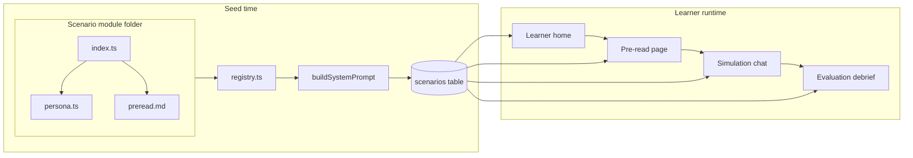

# Altius Scenario Module Guide

How to turn intake information into a **ScenarioModule** that Altius can seed, publish, and run. Each scenario is a **self-contained folder** — persona, scene rules, pre-read, and rubric live together. No shared persona library.

### Intake path (choose one)

| Buyer | Intake doc | Typical reference module |
| :--- | :--- | :--- |
| **Corporate / L&D** | [SCENARIO_INTAKE.md](./SCENARIO_INTAKE.md) | `vikram-sales/`, `vikram-parts/`, `vikram-service/`, `design-build-gcc-norway/` |
| **Higher education** | [SCENARIO_INTAKE_EDUCATION.md](./SCENARIO_INTAKE_EDUCATION.md) (+ shared sections in SCENARIO_INTAKE) | `flowbridge-discovery/`, `client-counselling-law/`, `divorce-custody-counselling/` |

### Reference implementations

| Module | Use when |
| :--- | :--- |
| **`accountability-under-pressure/`** | B-school accountability under pressure, regulatory meeting, AAA (implicit), Truth vs Loyalty |
| **`quiet-exit-retention/`** | OB/HRM retention conversation, Positions vs Interests (Getting to Yes), first-line manager |
| **`client-counselling-law/`** | Law client counselling, expectation management, procedural justice (Voice/Respect/Trust/Reasoning) |
| **`divorce-custody-counselling/`** | Law client counselling, Binder & Price non-legal goals, matrimonial first consult (fairness as wrong first question) |
| **`design-build-gcc-norway/`** | B2B discovery, cross-cultural expectation-setting, GCC / workplace scoping |
| **`difficult-feedback/`** | Difficult feedback, banking governance, SBI, empathy without collusion, shared accountability |
| **`flowbridge-discovery/`** | B2B discovery, async/crisis context, education / MBA lead qualification |
| **`fmcg-distributor-negotiation/`** | FMCG trade sales, discovery before pitch, distributor economics |
| **`sales-product-knowledge/`** | SaaS AE value selling, SPIN, product knowledge in context |
| **`vikram-sales/`** | High-stakes B2B sales, objection handling, TCO |
| **`vikram-parts/`** | Aftermarket / negotiation, total cost of ownership |
| **`vikram-service/`** | Service recovery, empathy under pressure |
| **`customer-success-renewals/`** | CSM renewal escalation, LEAP service recovery, Indian employee benefits |

---

## How Altius uses a scenario



### Prompt assembly at seed time

The runtime system prompt is built from two layers plus global guardrails:

```
scenarioPrompt          ← scene setup + scenario-specific if/then rules (index.ts)
persona.voicePrompt     ← character voice and baseline behavior (persona.ts)
global guardrails       ← added by buildSystemPrompt() in build-prompt.ts
```

Stored in the database as `personaConfig.systemPrompt`.

| Module source | DB column / field | Runtime use |
|---------------|-------------------|-------------|
| `title`, `subtitle`, `displayOrder` | `title`, `personaConfig` | Learner home card |
| `getPreReadMarkdown()` | `preReadMarkdown` | `/pre-read/[scenarioId]` |
| `moduleId` (folder name) | `personaConfig.moduleId` | Public URL slug — `/pre-read/vikram-sales`, demo CTAs, `resolve.ts` lookup |
| `firstMessage` | `firstMessage` | First assistant message on session start |
| `persona` + `scenarioPrompt` → `buildSystemPrompt()` | `personaConfig.systemPrompt` | Every chat turn |
| `persona.name` | `personaName` | UI labels, evaluation context |
| `persona.role`, `persona.company` | `personaConfig.role`, `.company` | Fallback prompt assembly |
| `evalRubric` | `evalRubric` | Post-session LLM evaluation |

---

## Folder structure

```
scenarios/
├── types.ts                 # ScenarioModule, ScenarioPersona interfaces
├── build-prompt.ts          # buildSystemPrompt() — composes runtime prompt
├── registry.ts              # Active modules (seed + publish control)
├── seed.ts                  # DB upsert logic
├── validate.ts              # Module validation (used by validate:scenarios)
└── modules/
    └── your-scenario-id/
        ├── index.ts         # ScenarioModule export
        ├── persona.ts       # ScenarioPersona for this scenario
        └── preread.md       # Pre-read briefing
```

**Rules:**

- **`id`** — stable kebab-case slug (e.g. `vikram-sales`). Stored as `personaConfig.moduleId`. Do not rename after launch.
- **One folder per scenario.** Persona lives in that folder's `persona.ts`, not in a shared directory.
- **Register** every published scenario in `registry.ts`. Modules removed from the registry are archived on next seed.

### Public URLs (`moduleId`)

- Folder `id` (e.g. `vikram-sales`) is stored as `personaConfig.moduleId` at seed time.
- Learners and demo CTAs use `/pre-read/{moduleId}` — **not** the DB UUID (`scenarios.id`).
- Resolver: `src/lib/scenarios/resolve.ts` (`findScenarioByRouteId`, `getScenarioRouteId`).
- Microsite featured demos: keep `landing-page/src/data/featured.ts` in sync with `registry.ts`.

---

## Step 1: Create `persona.ts`

Define the counterparty for **this scenario only**.

```ts
// scenarios/modules/your-scenario-id/persona.ts
import type { ScenarioPersona } from "../../types";

export const persona: ScenarioPersona = {
  name: "Jordan Lee",
  role: "Procurement Director",
  company: "Acme Logistics",
  voicePrompt: `
Who Jordan is:
- [Backstory, tenure, what they care about]

Voice and behavior in every reply:
- [Communication style, sample phrases]
- [How they respond to strong data vs vague answers]
- [How they admit being wrong]`,
};
```

### What belongs in `voicePrompt`

| Include | Exclude |
|---------|---------|
| Backstory and personality | Today's specific scene (boardroom, grounded trucks) |
| Default communication style | Scenario-only demands (30% discount, 13L engines) |
| Sample phrases | Non-negotiables unique to this simulation |
| Baseline reply patterns (strong data / weak data / corrected) | Evaluation criteria |

### Same persona in multiple scenarios

Copy `persona.ts` into each module folder. Duplication is expected and preferred over shared imports — each scenario stays independently editable. Align `voicePrompt` text across copies only when you want consistent voice.

---

## Step 2: Create `index.ts`

```ts
// scenarios/modules/your-scenario-id/index.ts
import { readFileSync } from "fs";
import { dirname, join } from "path";
import { fileURLToPath } from "url";
import type { ScenarioModule } from "../../types";
import { persona } from "./persona";

const DIR = dirname(fileURLToPath(import.meta.url));

const SCENARIO_PROMPT = `You are ${persona.name}, ${persona.role} at ${persona.company}. [Scene: where you are, who the participant is, what you just said.]

[Scenario-id]-specific:
- [Default posture in this scene]
- [When learner is vague]
- [When learner brings strong data]
- [Non-negotiables]
- [Acceptable concessions]`;

const scenario: ScenarioModule = {
  id: "your-scenario-id",
  displayOrder: 3,
  title: "The Working Title",
  subtitle: "Learner Role — one-line hook",
  learnerRole: "Area Sales Manager",
  persona,
  scenarioPrompt: SCENARIO_PROMPT,
  firstMessage: "...",              // customer's opening line
  maxTurns: 20,
  status: "published",
  evalRubric: { ... },              // see Step 4
  getPreReadMarkdown: () =>
    readFileSync(join(DIR, "preread.md"), "utf-8"),
};

export default scenario;
```

### Brief → module mapping

Shows where each module property comes from. Most properties are Claude-derived from the four-item brief. For HEI scenarios, also complete [SCENARIO_INTAKE_EDUCATION.md](./SCENARIO_INTAKE_EDUCATION.md) §1, §2, §5 (CO alignment).

| Module property | Source | From brief item |
|----------------|--------|-----------------|
| `persona.name`, `.company` | Claude | Invented — keeps scenarios fictional |
| `persona.role`, `.company` context | Claude + brief | Learner role from brief item 1 |
| `persona.voicePrompt` | Claude | Derived from situation and learning objectives |
| `scenarioPrompt` | Claude | Derived from situation, objectives, and open field |
| `firstMessage` | Claude | Derived from situation |
| `title`, `subtitle`, `learnerRole` | Claude | Derived from situation and learner role |
| `id`, `displayOrder`, `maxTurns` | Claude | Defaults; `id` slugged from title |
| `status` | SME confirms | Draft for pilot, published for learners |
| `getPreReadMarkdown()` → `preread.md` | Claude | Written from situation, objectives, and open field |
| `evalRubric` criteria, descriptions, bands | Claude | Derived from learning objectives |
| `evalRubric` evaluatorRole | Claude | Derived from domain and learner role |

Global guardrails are **not** written in the module — `buildSystemPrompt()` appends them:

```ts
// scenarios/build-prompt.ts
export function buildSystemPrompt(mod: ScenarioModule): string {
  return [
    mod.scenarioPrompt.trim(),
    mod.persona.voicePrompt.trim(),
    "Do not break character or mention you are an AI. Keep responses 2–4 short paragraphs.",
  ].join("\n\n");
}
```

---

## Step 3: Write `preread.md`

Claude writes the pre-read from the intake brief. The SME does not draft it. Loaded at seed time and rendered on the pre-read page.

**Template:**

```markdown
# [Title]

[Opening — no header. Third person on the counterparty or a scene from their world.
200–400 words. Ends on a beat that pulls the learner in before "you" enter.]

---

**[Section: context or backstory]**
[History that explains the conflict. Off-screen characters who matter.]

---

**[Section: learner's stake]**
[Why the learner is here. Their history with the counterparty. Where their own
accountability or complicity begins.]

---

**[Section: what the learner knows today]**
[Facts, numbers, documents, calls — the evidence they carry into the room.]

---

**[Section: entering the room]**
[Final scene. Physical setting. Ends one beat before `firstMessage`. No meta-language.]

**[END OF PRE-READ]**
```

Headers are **bold inline** (`**Section title**`), not `###`. No "CHAPTER N:" prefix. Sections are named for their content. The opening section has no header.

**Quality bar:**

- End on the **exact beat** before `firstMessage`.
- Include **actionable numbers** when learners must calculate TCO, ROI, or cost-share.
- Do **not** embed `voicePrompt`, `scenarioPrompt`, or rubric text.

**Writing craft and discovery rules (see [SCENARIO_INTAKE.md §7](./SCENARIO_INTAKE.md#7-pre-read-briefing-content-required) for full guidance):**

- Target 1,500–2,500 words. Multiple named sections. At least one dialogue exchange.
- No em-dashes. Period.
- Open on a scene, not context.
- Prose for character; one reference table maximum for data learners will look up mid-conversation.
- Vary sentence rhythm. No balanced pairs ("This is not X. It is Y."), no symmetrical triplets, no numbered strategy summaries at the end. Existing pre-reads have these — new modules should not repeat the pattern.
- No meta-language ("the simulation begins here," "your goal is to").
- Do not reveal what the counterparty is holding back or what question will unlock them.
- Do not complete calculations for the learner. Give data; let them do the math in the room.
- Do not use real company or client names. Learner's firm is always "your firm" or "the firm." Counterparty companies and individuals are fictional.

---

## Step 4: Define `evalRubric`

Translate intake [§8 Evaluation rubric](./SCENARIO_INTAKE.md#8-evaluation-rubric-required) (and for HEI, [§5 CO alignment](./SCENARIO_INTAKE_EDUCATION.md#5-evaluation-rubric--co-alignment-required)) into TypeScript:

```ts
evalRubric: {
  evaluatorRole: "expert sales coach",
  criteria: [
    {
      name: "Discovery & Diagnosis",
      description: "Did the learner uncover concerns beyond sticker price?",
      scale: 5,
    },
    // 3–5 criteria
  ],
  overallGuidance:
    "16+/20 = Excellent. 12-15 = Good. 8-11 = Needs Improvement. <8 = Significant gaps.",
},
```

| Rule | Reason |
|------|--------|
| 3–5 criteria | Readable debrief |
| `scale: 5` each | Consistent with existing modules |
| Observable descriptions | Evaluator cites transcript moments |
| Distinct `name` values | Become score keys in debrief |
| `overallGuidance` bands | Should match `criteria.length × scale` |

---

## Step 5: Register the module

```ts
// scenarios/registry.ts
import yourScenario from "./modules/your-scenario-id";

export const SCENARIO_MODULES: ScenarioModule[] = [
  // ...existing
  yourScenario,
];
```

- **Add** → seeded/updated on next `npm run seed:scenarios`
- **Remove** → existing DB row archived (matched by `personaConfig.moduleId`)

---

## Step 6: Seed to the database

Validate modules first, then seed from `v1/app/` with `DATABASE_URL` in `.env.local`:

```bash
npm run validate:scenarios
npm run seed:scenarios
```

Seed behavior:

- Upserts by **`personaConfig.moduleId`** (falls back to `title` for first-time migration)
- Composes `personaConfig.systemPrompt` via `buildSystemPrompt(mod)`
- Sets `personaName` from `mod.persona.name`
- Sets `personaConfig.role` / `.company` from `mod.persona`
- Archives published scenarios whose `moduleId` is no longer in the registry

---

## Step 7: Verify end-to-end

| Check | How |
|-------|-----|
| Home card | Title, subtitle, turn count, sort order |
| Pre-read | Markdown renders; ends before chat |
| First message | Matches narrative; correct tone |
| Persona voice | Baseline patterns from `voicePrompt` hold across turns |
| Scenario rules | Scene-specific pushback and concessions work |
| Evaluation | Debrief shows 3–5 scores with cited moments |
| Draft mode | `status: "draft"` hidden from learner home |

Pilot 2–3 conversations with the SME; tune `scenarioPrompt` first (most impact), then `voicePrompt` if character drifts.

---

## Complete minimal example

```
scenarios/modules/acme-renewal/
├── persona.ts
├── index.ts
└── preread.md
```

```ts
// persona.ts
import type { ScenarioPersona } from "../../types";

export const persona: ScenarioPersona = {
  name: "Jordan Lee",
  role: "Procurement Director",
  company: "Acme Logistics",
  voicePrompt: `
Who Jordan is:
- Fifteen years in procurement; evaluates vendors on total cost, not list price.

Voice and behavior in every reply:
- Direct and numbers-first. "Show me the impact in dollars."
- Softens when given quantified uptime or SLA recovery data; tests with one follow-up.`,
};
```

```ts
// index.ts
import { readFileSync } from "fs";
import { dirname, join } from "path";
import { fileURLToPath } from "url";
import type { ScenarioModule } from "../../types";
import { persona } from "./persona";

const DIR = dirname(fileURLToPath(import.meta.url));

const SCENARIO_PROMPT = `You are Jordan Lee, Procurement Director at Acme Logistics. The participant is your account manager. You are reviewing a renewal and just said you are leaning toward switching vendors unless they justify the 12% price increase.

Renewal-specific:
- Lead with total cost and SLA breaches last quarter.
- You will NOT accept a blanket discount without a service commitment.`;

const scenario: ScenarioModule = {
  id: "acme-renewal",
  displayOrder: 10,
  title: "The Renewal Crunch",
  subtitle: "Account Manager — defend renewal vs switch",
  learnerRole: "Account Manager",
  persona,
  scenarioPrompt: SCENARIO_PROMPT,
  firstMessage:
    "I've got three bids on my desk. Yours is twelve percent higher than last year. Give me one reason I shouldn't switch.",
  evalRubric: {
    evaluatorRole: "expert account management coach",
    criteria: [
      {
        name: "Discovery",
        description: "Did the learner uncover Jordan's real drivers beyond price?",
        scale: 5,
      },
      {
        name: "Value Proof",
        description: "Did the learner quantify value or SLA recovery with specifics?",
        scale: 5,
      },
      {
        name: "Commercial Creativity",
        description: "Did the learner propose a credible path without a blind discount?",
        scale: 5,
      },
    ],
    overallGuidance:
      "12+/15 = Excellent. 9-11 = Good. 6-8 = Needs Improvement. <6 = Significant gaps.",
  },
  getPreReadMarkdown: () =>
    readFileSync(join(DIR, "preread.md"), "utf-8"),
};

export default scenario;
```

---

## Anti-patterns

| Anti-pattern | Why it fails |
|--------------|--------------|
| Shared `_personas/` library | Scenarios become coupled; persona edits break unrelated modules |
| Scene-specific rules in `voicePrompt` | Persona layer bleeds into scenario layer; hard to tune independently |
| Putting guardrails in every module | Duplicated; use `buildSystemPrompt()` instead |
| Pre-read that resolves the whole conversation | Nothing left to practice |
| Changing `id` after learners have sessions | Breaks registry archival and analytics |
| Forgetting `registry.ts` | Module never seeds |
| Editing DB manually | Code and database diverge |

---

## Type reference

```ts
interface ScenarioPersona {
  name: string;
  role: string;
  company: string;
  voicePrompt: string;
}

interface ScenarioModule {
  id: string;
  displayOrder: number;
  title: string;
  subtitle: string;
  learnerRole: string;
  persona: ScenarioPersona;
  scenarioPrompt: string;
  firstMessage: string;
  evalRubric: EvalRubric;
  maxTurns?: number;
  locale?: string;
  status?: "draft" | "published" | "archived";
  personaConfig?: Record<string, unknown>;
  getPreReadMarkdown: () => string;
}
```

Authoritative definitions: `scenarios/types.ts`.

---

## Related documents

- [SCENARIO_INTAKE.md](./SCENARIO_INTAKE.md) — Corporate / L&D intake checklist
- [SCENARIO_INTAKE_EDUCATION.md](./SCENARIO_INTAKE_EDUCATION.md) — Higher-ed intake (CO alignment, law/medical/hospitality)
- [ACCREDITATION_EVIDENCE.md](../../ACCREDITATION_EVIDENCE.md) — CO/PO mapping and accreditation artefacts
- `scenarios/build-prompt.ts` — Prompt composition
- `scenarios/validate.ts` — Module validation (`npm run validate:scenarios`)
- `src/lib/llm/evaluation.ts` — Post-session scoring
- `src/lib/llm/prompt-assembly.ts` — Runtime prompt read from DB
